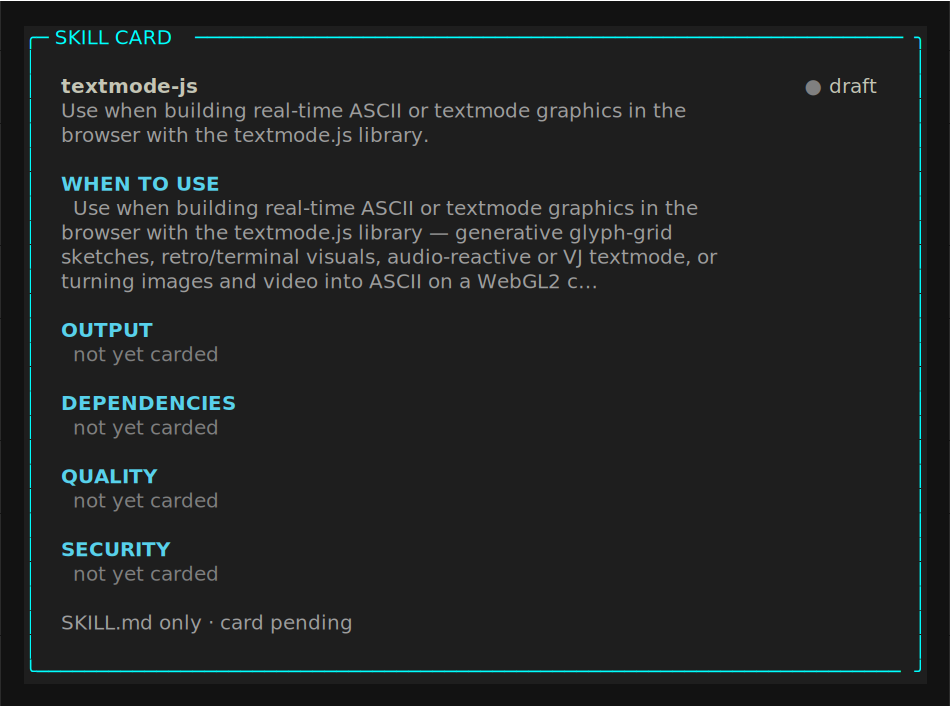

# textmode-js

<!-- card:begin summary -->

_Skill card pending. This skill ships a `SKILL.md` but has no published `card.json` yet, so the summary block fills in once it is carded._

<!-- card:end summary -->

<!-- card:begin badges -->

_Skill card pending. This skill ships a `SKILL.md` but has no published `card.json` yet, so the badges block fills in once it is carded._

<!-- card:end badges -->

## Skill card

<!-- card:begin scorecard -->



<!-- card:end scorecard -->

## What it does

This skill builds real-time textmode graphics in the browser with `textmode.js`, a
zero-dependency WebGL2 library that renders to a grid of character cells with
p5.js-style ergonomics. It covers the create/setup/draw lifecycle, glyph and color
cells, animation and noise, layers, custom GLSL shaders, and export to TXT, SVG,
PNG, GIF, MP4, or WebM.

## When it triggers

<!-- card:begin triggers -->

_Skill card pending. This skill ships a `SKILL.md` but has no published `card.json` yet, so the triggers block fills in once it is carded._

<!-- card:end triggers -->

## Install

Copy the skill folder into a place Claude reads skills.

```bash
git clone https://github.com/vinsonconsulting/claude-skill-foundry
cp -r claude-skill-foundry/skills/ascii-art/textmode-js ~/.claude/skills/
```

Use `.claude/skills/` inside a project to scope it to one repo instead of your user.

## Example

Describe a sketch and the skill writes the lifecycle.

> Make a full-screen textmode sketch driven by a noise-field glyph ramp.

The skill scaffolds `textmode.create({...})` with `setup` and `draw`, sets
`char`/`charColor`/`cellColor` per cell, and samples a noise field to pick glyphs
from a ramp each frame. It flags the common trip-up up front: the origin `(0,0)` is
the grid center, not the top-left.

## Quality

<!-- card:begin metrics -->

_Skill card pending. This skill ships a `SKILL.md` but has no published `card.json` yet, so the metrics block fills in once it is carded._

<!-- card:end metrics -->

## Links

- [`SKILL.md`](SKILL.md): the instructions Claude follows.

The card files (`card.json`, `skill-card.md`, `report.sarif`) appear once this
skill is carded.
