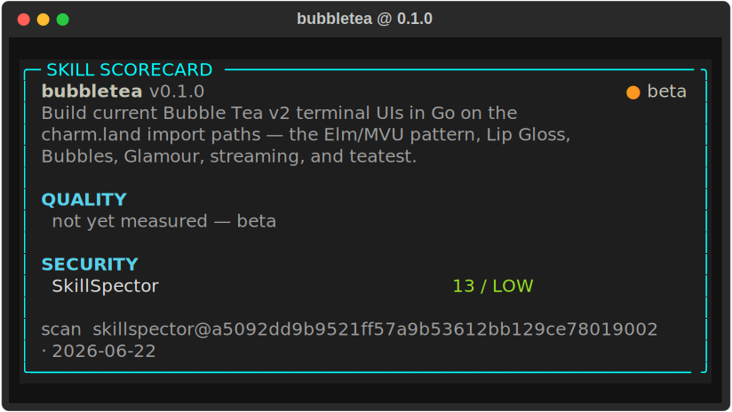

# bubbletea

<!-- card:begin summary -->

Build current Bubble Tea v2 terminal UIs in Go on the charm.land import paths — the Elm/MVU pattern, Lip Gloss, Bubbles, Glamour, streaming, and teatest.

<!-- card:end summary -->

<!-- card:begin badges -->

[](skill-card.md)


<!-- card:end badges -->

## Skill card

<!-- card:begin scorecard -->



<!-- card:end scorecard -->

## What it does

This skill writes Bubble Tea code for the current v2 release on the `charm.land`
import paths. It covers the Elm Architecture model (`Init`/`Update`/`View`), Lip
Gloss styling, the Bubbles component set, Glamour markdown rendering, and teatest.
It is built for streaming output, such as piping LLM tokens from a goroutine into
a viewport.

## When it triggers

<!-- card:begin triggers -->

**Use it when**

- build a Bubble Tea TUI in Go with a viewport and a list
- wire up the Elm Architecture Init/Update/View for my Bubble Tea model
- stream LLM tokens from a goroutine into a Bubble Tea viewport
- style a layout with Lip Gloss v2 and compose blocks side by side
- my Bubble Tea Cmd/Msg isn't updating the model — debug the event flow
- add a spinner and a progress bar from Bubbles to my Go TUI
- render markdown in the terminal with Glamour inside Bubble Tea
- write a teatest test for my Bubble Tea program
- migrate my Bubble Tea v1 code to the charm.land v2 import paths
- build an interactive full-screen Go CLI with a text input and a table
- handle WindowSizeMsg resize and recompute my Lip Gloss layout
- measure display width correctly for CJK/emoji in my Bubble Tea view

**Reach for a sibling instead when**

- build a Rust terminal UI → use [`ratatui`](../ratatui/README.md)
- build a Python TUI with Textual → use [`textual`](../textual/README.md)
- convert an image to ASCII art → use [`image-to-ascii`](../../ascii-art/image-to-ascii/README.md)
- render an image as terminal color blocks → use [`textmode-js`](../../ascii-art/textmode-js/README.md)
- make an ASCII-art React component → use [`ascii-img-react`](../../ascii-art/ascii-img-react/README.md)
- colorize a one-shot CLI message with fmt/cobra, no live UI → plain CLI output (no TUI skill)
- standalone lipgloss styling with no program loop → plain CLI output (no TUI skill)
- build a browser or GUI app → web/GUI UI (out of scope)
- multiplex processes or orchestrate tmux → session orchestration (out of scope)
- write release notes for my Go library → changelog (out of scope)

<!-- card:end triggers -->

## Install

Copy the skill folder into a place Claude reads skills.

```bash
git clone https://github.com/vinsonconsulting/claude-skill-foundry
cp -r claude-skill-foundry/skills/tui/bubbletea ~/.claude/skills/
```

Use `.claude/skills/` inside a project to scope it to one repo instead of your user.

## Example

Ask for a component and the skill writes current-version Go.

> Build a Bubble Tea model with a `viewport` that scrolls streamed text, and wire
> `WindowSizeMsg` to resize it.

The skill returns a `tea.Model` with `Init`/`Update`/`View`, a `viewport.Model`
field, a `WindowSizeMsg` branch that recomputes the viewport size, and a `Cmd` that
feeds streamed lines through `Update`. The code imports `charm.land/bubbletea/v2`
and compiles against Go 1.25.

## Quality

<!-- card:begin metrics -->

Quality metrics are not published yet (status: beta). The security scan is LOW (13/100).

<!-- card:end metrics -->

## Links

- [`SKILL.md`](SKILL.md): the instructions Claude follows.
- [`skill-card.md`](skill-card.md): the card in human-readable form.
- [`card.json`](card.json): the card in machine form.
- [`scan.json`](scan.json): the SkillSpector scan and findings.
