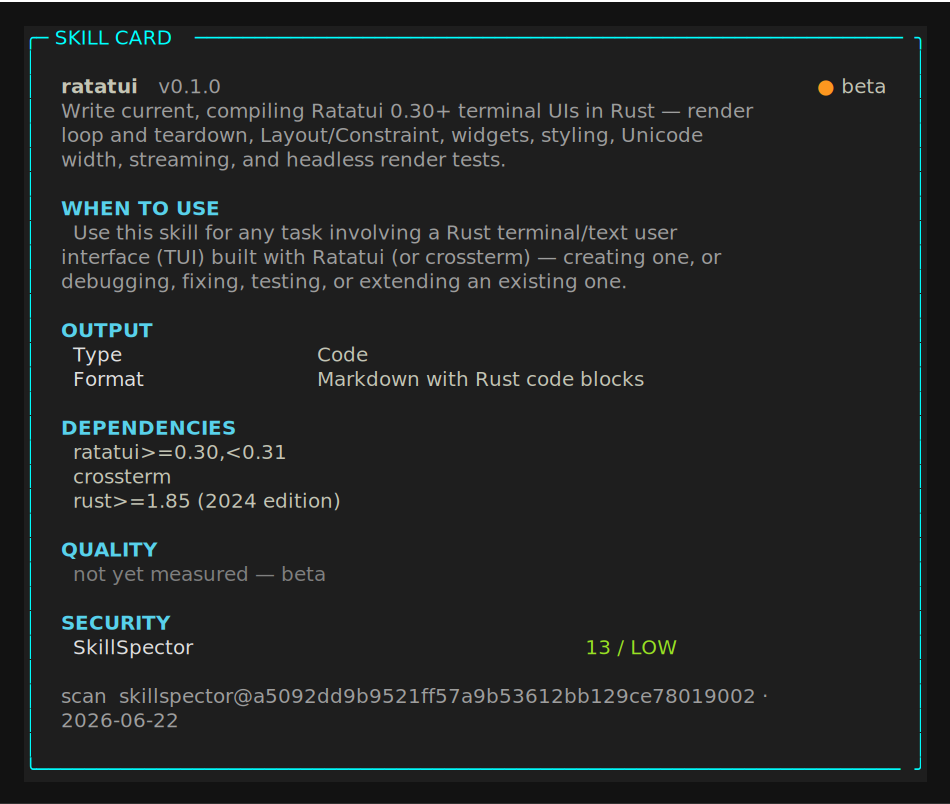

# ratatui

<!-- card:begin summary -->

Write current, compiling Ratatui 0.30+ terminal UIs in Rust — render loop and teardown, Layout/Constraint, widgets, styling, Unicode width, streaming, and headless render tests.

<!-- card:end summary -->

<!-- card:begin badges -->

[](skill-card.md)


<!-- card:end badges -->

## Skill card

<!-- card:begin scorecard -->



<!-- card:end scorecard -->

## What it does

This skill writes current Ratatui (0.30+) terminal UIs in Rust on crossterm. It
covers the render loop and panic-safe teardown, Layout and Constraint, the widget
set (List, Table, Gauge, Chart, Scrollbar) with selection and scroll state,
Unicode width, streaming async output, and headless render tests with TestBackend.

## When it triggers

<!-- card:begin triggers -->

**Use it when**

- build a Rust dashboard TUI with ratatui that has a sidebar and a live-updating chart
- my ratatui app leaves the terminal in raw mode after a panic — fix the teardown
- lay out three panels with Layout and Constraint in ratatui
- render a scrollable List with persistent selection state in ratatui
- stream tokens from an async task into a ratatui terminal without flicker
- my ratatui table's Unicode/CJK column widths are misaligned
- write a headless render test for my ratatui widget with TestBackend
- set up the crossterm event loop and terminal init for a new ratatui app
- add a popup/modal overlay on top of my ratatui layout
- migrate my old tui-rs code to current ratatui 0.30
- draw a Gauge and a Sparkline that update each frame in ratatui
- why does my ratatui Scrollbar not move when I scroll the list

**Reach for a sibling instead when**

- build a terminal UI in Go with Bubble Tea → use [`bubbletea`](../bubbletea/README.md)
- build a Python TUI with Textual → use [`textual`](../textual/README.md)
- convert this image to ASCII art → use [`image-to-ascii`](../../ascii-art/image-to-ascii/README.md)
- render an image as colored terminal blocks → use [`textmode-js`](../../ascii-art/textmode-js/README.md)
- make an ASCII-art React component → use [`ascii-img-react`](../../ascii-art/ascii-img-react/README.md)
- add a progress bar to a non-interactive CLI script → plain CLI output (no TUI skill)
- just print a colored table to stdout, no interactivity → plain CLI output (no TUI skill)
- build a web dashboard in React → web UI (out of scope)
- orchestrate tmux panes for my agent session → session orchestration (out of scope)
- write a CLAUDE.md for my Rust project → project docs (out of scope)

<!-- card:end triggers -->

## Install

Copy the skill folder into a place Claude reads skills.

```bash
git clone https://github.com/vinsonconsulting/claude-skill-foundry
cp -r claude-skill-foundry/skills/tui/ratatui ~/.claude/skills/
```

Use `.claude/skills/` inside a project to scope it to one repo instead of your user.

## Example

Describe the bug and the skill writes the fix.

> My ratatui app leaves the terminal in raw mode after a panic. Fix the teardown.

The skill restores the terminal inside a panic hook (it leaves the alternate screen
and disables raw mode before the default hook runs) and moves teardown into a guard
type with a `Drop` impl, so a normal return cleans up too. The code targets ratatui
0.30 on the Rust 2024 edition.

## Quality

<!-- card:begin metrics -->

Quality metrics are not published yet (status: beta). The security scan is LOW (13/100).

<!-- card:end metrics -->

## Links

- [`SKILL.md`](SKILL.md): the instructions Claude follows.
- [`skill-card.md`](skill-card.md): the card in human-readable form.
- [`card.json`](card.json): the card in machine form.
- [`scan.json`](scan.json): the SkillSpector scan and findings.
