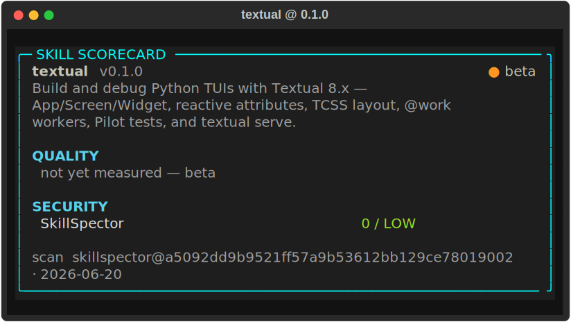

# textual

<!-- card:begin summary -->

Build and debug Python TUIs with Textual 8.x — App/Screen/Widget, reactive attributes, TCSS layout, @work workers, Pilot tests, and textual serve.

<!-- card:end summary -->

<!-- card:begin badges -->

[](skill-card.md)


<!-- card:end badges -->

## Scorecard

<!-- card:begin scorecard -->



<!-- card:end scorecard -->

## What it does

This skill builds and debugs Python TUIs with Textual 8.x. It covers App, Screen,
and Widget, reactive attributes and their `watch_` methods, TCSS layout (`dock`,
`grid`, `fr` units), `@work` workers, the widget set (`RichLog`, `DataTable`,
`Input`, `Tree`), Pilot tests, and `textual serve` for browser deploy.

## When it triggers

<!-- card:begin triggers -->

**Use it when**

- build a Textual app with a DataTable and a Footer
- my reactive attribute isn't updating the widget — fix the watch_ method
- lay out two panels side by side with TCSS dock/grid
- push a modal Screen and return a value when it dismisses
- run a long task in a @work worker without blocking the Textual UI
- stream agent tokens into a RichLog in my Textual app
- write a Pilot test / pytest-textual-snapshot for my Textual app
- deploy my Textual app to the browser with textual serve
- why does textual run show a blank screen
- style widgets with TCSS using fr units and dock
- embed a Rich renderable inside a Textual widget
- build a Tree or ListView navigation pane in Textual

**Reach for a sibling instead when**

- build a Rust terminal UI → use [`ratatui`](../ratatui/README.md)
- build a Go TUI with Bubble Tea → use [`bubbletea`](../bubbletea/README.md)
- convert an image to ASCII art → use [`image-to-ascii`](../../ascii-art/image-to-ascii/README.md)
- render an image as terminal color blocks → use [`textmode-js`](../../ascii-art/textmode-js/README.md)
- make an ASCII-art React component → use [`ascii-img-react`](../../ascii-art/ascii-img-react/README.md)
- parse CLI flags with argparse/Click, no live UI → plain CLI output (no TUI skill)
- print a one-shot colored table with Rich, no app loop → rich-only output (out of scope)
- build a general React/HTML web app → web UI (out of scope)
- draw directly with curses windows → curses (out of scope)
- orchestrate tmux or agent sessions → session orchestration (out of scope)

<!-- card:end triggers -->

## Install

Copy the skill folder into a place Claude reads skills.

```bash
git clone https://github.com/vinsonconsulting/claude-skill-foundry
cp -r claude-skill-foundry/skills/tui/textual ~/.claude/skills/
```

Use `.claude/skills/` inside a project to scope it to one repo instead of your user.

## Example

Describe the goal and the skill keeps the UI responsive.

> Run a long task in a worker without freezing my Textual UI.

The skill moves the work into an `@work(thread=True)` method, posts results back
with `self.post_message`, and updates a reactive attribute whose `watch_` method
refreshes the widget. The event loop stays free, so input keeps flowing while the
task runs.

## Quality

<!-- card:begin metrics -->

Quality metrics are not published yet (status: beta). The security scan is LOW (0/100).

<!-- card:end metrics -->

## Links

- [`SKILL.md`](SKILL.md): the instructions Claude follows.
- [`skill-card.md`](skill-card.md): the card in human-readable form.
- [`card.json`](card.json): the card in machine form.
- [`scan.json`](scan.json): the SkillSpector scan and findings.
